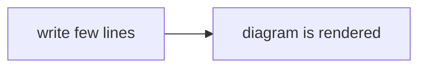

#pkm

### Markdown & Obsidian Cheat Sheet

Obsidian uses Markdown. Markdown is a simple text formatting syntax. Compared wit a *What you see is what you get* editor like Microsoft Word, it might feel strange in the beginning. As only very few syntax is needed, I'm sure you will soon love it. There's not much thinking and wasting time about formatting.
Obsidian is by default displaying the rendered version. Only when you put your cursor to the line or into the formatted text, you will see the syntax characters. 

The big advantage using Markdown is that they are all text files (like the .txt extension you sometimes see on your computer). So they are readable on any system. The extension .md says only that syntax for interpretation is included in the format mark-down. This means, all your files will also be readable in your far future, which is quite important for saved thoughts. 

#### Basic Formatting

##### Links
Write `[[Your thougth]]` in a note to create a link to another file/thought.
<pre style="background:#0000;padding:10px;border-radius:6px;overflow:auto;"><code>
[[This is a link to a file]]
</code></pre>

##### Italic, Bold, Highlight

*your word or sentence in italic*
<pre style="background:#0000;padding:10px;border-radius:6px;overflow:auto;"><code>
*your word or sentence in italic*
</code></pre>

**your word or sentence in bold**
<pre style="background:#0000;padding:10px;border-radius:6px;overflow:auto;"><code>
**your word or sentence in bold**
</code></pre>

<mark>Your highlighted text</mark>
<pre style="background:#0000;padding:10px;border-radius:6px;overflow:auto;"><code>
==your word or sentence highlighted==
</code></pre>

##### Headers

#, ##, ###, ...., For headings. You simply write `# YOUR HEADING`. And when you go to the next line, you see the formatted heading. You can go down to six hierarchical levels. the `# First Level` und the `###### sixth level`

- # first hierarchical level
- ## second hierarchical level
- ### third hierarchical level 
- …
- ###### sixth level

##### Lists & Bullet Points

There are different listing options you can use.

Bullet points are done with `- your point` or `* your point`. As `*` is also used for bolt and kursiv, the use of minus `-` is more favorable. e.g.
- bullet point one
- bullet point two
- bullet …

Numbered Lists are simply began with `1. your item`. e.g.
1. your item
2. your second item
3. …

##### Checklists

When you have the need for a checklist, let's say you write down activities you want to do in the note, you can use the syntax `- [] activiy`. e.g.
- [ ] activity 1
- [ ] activity 2
- [ ] …

##### Comments

There are two kinds of comments. The ones which are intended as comments for the reader when and if published (I will call this one only comment), and the ones who are silent thoughts not intended to be published. 

A comment is very useful for e.g. quotes. e.g.

> This is a quote - date, author

**comments intented for readers**
A comment is startet with `>␣`. Every new line will be continued with the symbol `>` till you hit new line twice. e.g.
> This is a comment
> continued in next line.

> you can have there several comments when there is a newline in between. 

**the silent one**
Silent comments are encapsulated with `%%`. So by writing `%% this is a comment %%`, you have added a comment. They are not necessary. It depends on you, if you would like to use them. There are possibilities to export notes into PDFs in which such comments would then not be included. Or you simply like the light grey rendering. 

##### Embedding Files and Images (\![\[ ]] syntax)

You can link to any file in your vault by using `[[File Name]]`. When you put a `!` in front, it tells Obsidian to display directly what's behind it. 
A picture will be shown. A markdown file will also be shown. 

##### Obsidian Cheat Sheet (External)

You can get here an Obsidian Cheat Sheet 
https://github.com/ieshreya/Obsidian-Cheat-Sheet

#### Tags

Tags are like stickers you can add to your notes. Simply write `#` followed by a word or even icon. No space in between. e.g. `#permanent`, `#inbox`, `#bibnote`, `#💡`, `#MOC`

Nested tags are possible too. e.g. `#MOC/Level1`, `#MOC/Level2`, `#💡/📔`, `#🌱/ToDo/myself`

#### Pipes in Links (Display Aliases)

With a pipe operator `|`, you can change the displayed name in a link. Let's asume you have the link `[[Unpredictability can be a strong motivation and is seen in the Ocalysis Framework as Core Drive 7]]`. This is a pretty long text. And you would like to shorten it to just `Core Drive 7`, as you now what's behind it. So you would write `[[Unpredictability can be a strong motivation and is seen in the Ocalysis Framework as Core Drive 7|Core Drive 7]]`. This is then rendered to `Core Drive 7`.


#### Metadata 
Each file has by default metadata like *date of creation*, *time last edited*, *filename*, and some more. You can add metadata yourself at the top of your note by writing in the very first line three dashes `---` . You can give the attribute any name, define the type of it and then enter a value. As an example, you could add a source like an author to your bib-notes. It's also possible to add tags there. I'm still recomending adding tags inline instead, this is easier to maintain. 

Another possibility to add information inline to the metadata is the use of `::`. 
You could write `author::snow` to add the attribute *author* with the value *snow* directly inline. 

#### Mermaid (Text‑Based Diagrams)

mermaid is a great way to add some graphs to your notes without having the need to create a picture in some other program and add it. The best, you can maintain it directly in the note by just changing the text. 

e.g.


This is done by writing:
<pre style="background:#000000;padding:10px;border-radius:6px;overflow:auto;"><code>

</code></pre>

On https://mermaid.live you can explore examples and the documentation. 

#### Dataview (Dynamic Queries) 

Dataview is providing a lightweight and flexible syntax. I would compare it to a database syntax. You can do quite a lot with it. The easiest use is to create some dynamic tables based on tags and or metadata. The plugin is an community plugin. At the time of this writing it's the second most downloaded plugin. 

Here an example how to write a query you could use on your starting page to overlook your inbox (when you use the tag `#inbox` for your fleeting notes)

<pre style="background:#000000;padding:10px;border-radius:6px;overflow:auto;"><code>
```dataview
List FROM #inbox
```
</code></pre>


